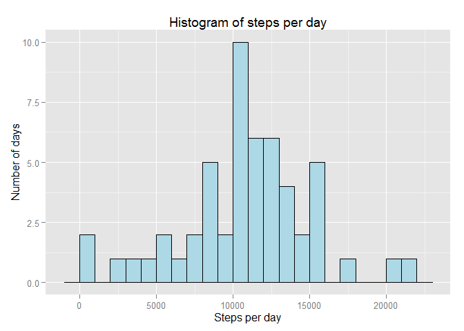
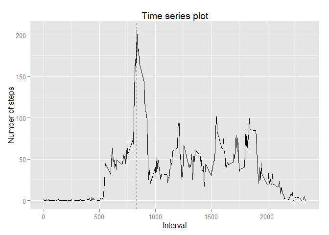
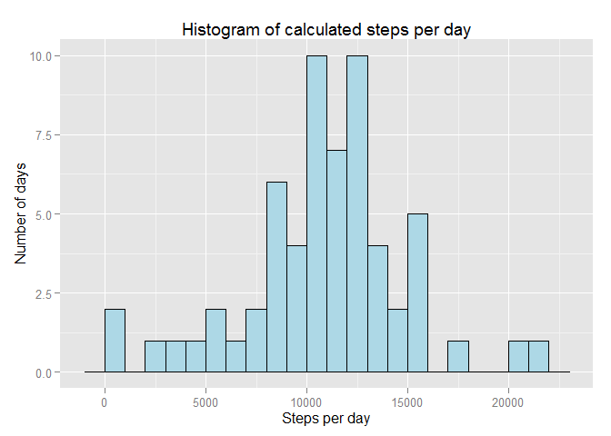
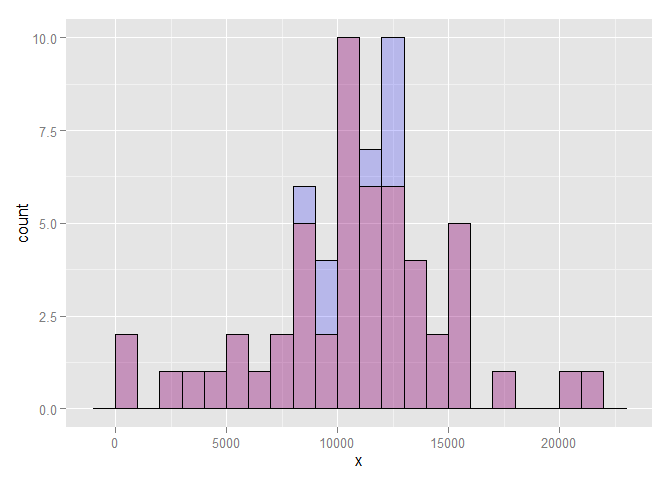
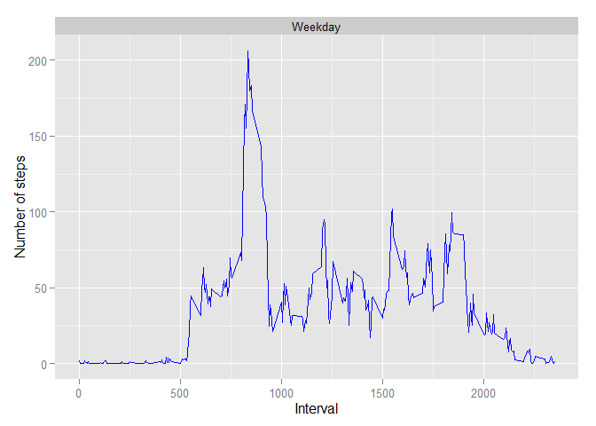

# Reproducible Research: Peer Assessment 1


```r
Sys.setlocale("LC_TIME","C")
```

```
## [1] "C"
```

## Loading and preprocessing the data
This part will open the zipe file and read the data from the included activity.csv. The read will include NA values and transform all columns to appropriate data type.


```r
activityCsv <- unz("activity.zip","activity.csv")
activityData <- read.csv(activityCsv, header = TRUE, sep=",", na.strings="NA" )
activityData$date = as.Date(activityData$date)
```


## What is mean total number of steps taken per day?

```r
stepsPerDay <- aggregate(activityData$steps, by=list(activityData$date), FUN=sum, na.RM=TRUE)

library(ggplot2)
histogram <- ggplot(stepsPerDay, aes(x=x))
histogram <- histogram + geom_histogram(binwidth=1000, colour="black", fill="lightblue")
histogram <- histogram + xlab("Steps per day") + ylab("Number of days") + ggtitle("Histogram of steps per day")
histogram
```

 

Mean is calculated by  

```r
as.integer(mean(stepsPerDay$x, na.rm=TRUE)) 
```

```
## [1] 10767
```

and median by

```r
as.integer(median(stepsPerDay$x, na.rm=TRUE))
```

```
## [1] 10766
```

## What is the average daily activity pattern?

```r
activityPattern = aggregate(activityData$steps , by = list(activityData$interval), FUN = mean, na.rm=TRUE)  

activityPlot <- ggplot(activityPattern, aes(x=Group.1, y=x)) 
activityPlot <- activityPlot + geom_line()
#Add labels
activityPlot <- activityPlot + xlab("Interval") + ylab("Number of steps") + ggtitle("Time series plot") 
#Add line indicating interval with maximum number of steps
activityPlot <- activityPlot + geom_vline(aes(xintercept=activityPattern[which.max(activityPattern$x),]$Group.1), colour="red", linetype="dashed")

activityPlot
```

 

The maximum is marked as a dashed line, and can be found by  

```r
max(activityPattern$x)
```

```
## [1] 206.1698
```

## Inputing missing values
The number of missing values can be found by

```r
sum(is.na(activityData$steps))
```

```
## [1] 2304
```

We then replace the values by calculating mean for each weekday and interval and convert to an integer.

```r
activityData$weekday <- weekdays(activityData$date)
replacementValues <- aggregate(activityData$steps, by=list(activityData$weekday, activityData$interval), FUN=mean, na.rm=TRUE)

names(replacementValues) <- c("weekday", "interval", "value")
replacementValues$value <- as.integer(replacementValues$value)
```

 This is then merged with the original dataset by using the data.table library using weekday and interval as key. Once this is done, na values are replaced with calculated value for weekday/time interval before we calculate steps per day. 

```r
library(data.table)
replacementTable <- data.table(replacementValues, key=c("weekday", "interval"))
activityTable <- data.table(activityData, key=c("weekday", "interval"))
resultTable <- activityTable[replacementTable]
resultTable <- resultTable[is.na(steps),steps:=value]
resultTable <- resultTable[order(date,interval)]

calculatedStepsPerDay <- aggregate(resultTable$steps, by=list(resultTable$date), FUN=sum, na.RM=TRUE)
```

Resulting plot 

```r
histogram <- ggplot(calculatedStepsPerDay, aes(x=x))
histogram <- histogram + geom_histogram(binwidth=1000, colour="black", fill="lightblue")
histogram <- histogram + xlab("Steps per day") + ylab("Number of days") + ggtitle("Histogram of calculated steps per day")
histogram
```

 

Mean is calculated by  

```r
as.integer(mean(calculatedStepsPerDay$x, na.rm=TRUE)) 
```

```
## [1] 10810
```

and median by

```r
as.integer(median(calculatedStepsPerDay$x, na.rm=TRUE))
```

```
## [1] 11016
```

The difference can be shown by creating an overlay on the histograms, where blue represents the new values. 

```r
histogram <- ggplot(calculatedStepsPerDay, aes(x=x))
histogram <- histogram + geom_histogram(binwidth=1000, colour="black", fill="blue", alpha="0.2")
histogram <- histogram + geom_histogram(data=stepsPerDay, binwidth=1000, colour="black", fill="red", alpha="0.2")
histogram
```

 

## Are there differences in activity patterns between weekdays and weekends?

Add a factor called dayType indicating weekday or weekend. Then create aggregate by dayType and interval which is used in the plot where dayType determines the facet_wrap. 

```r
activityData$dayType <- as.factor(ifelse(activityData$weekday %in% c("Saturday", "Sunday"),"Weekend", "Weekday"))

activityPatternByDayType <- aggregate(activityData$steps, by=list(activityData$dayType, activityData$interval), FUN=mean, na.rm=TRUE)
  
ggplot(activityPatternByDayType,aes(Group.2,x)) + facet_wrap( ~ Group.1, ncol=1) + geom_line(colour="blue") + xlab("Interval") + ylab("Number of steps")
```

 

